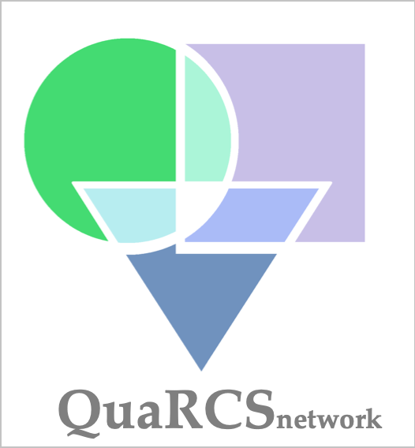
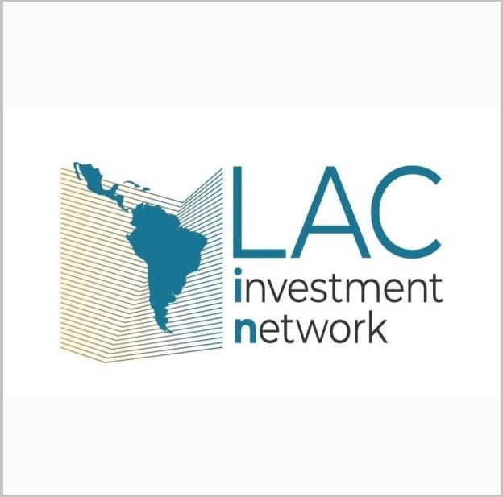
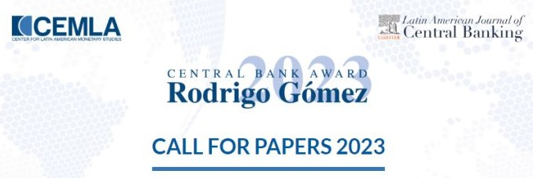
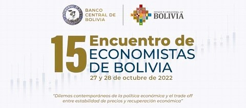
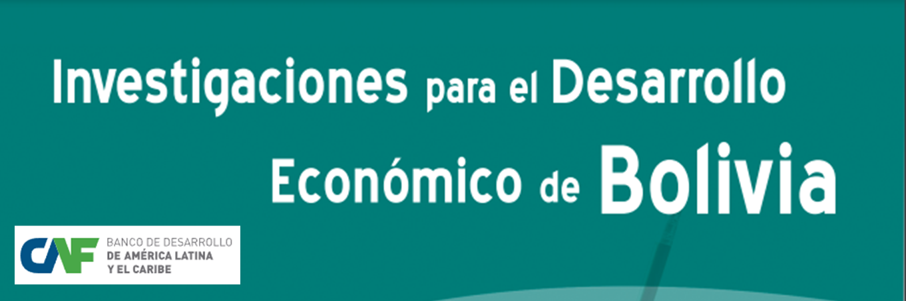
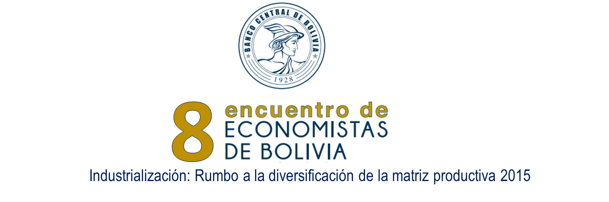

<!-- Google tag (gtag.js) -->

# About

As an economist specializing in economic research, policy analysis, and data-driven decision-making, I am passionate about harnessing the transformative potential of AI and advanced econometric methods to address complex macro and microeconomic challenges. With a proven track record in leading AI-driven projects, conducting socio-economic assessments, and designing data governance frameworks, I am committed to evidence-based policy-making that promotes sustainable development. My expertise extends to collaborating with international organizations and providing technical insights to inform public policy in Bolivia, bridging technology and economic insights for a more informed and resilient future.

  
## Experience / Skills

  

Economic Research • AI • Machine Learning • Econometrics • Remote Sensing • Data Science / Critical Thinking • Problem Solving

  
## Badges

  

  

## Affiliations/Networks

  
  

  
## Honors & awards

  

<!-- Rodrigo Gomez 2023 -->

First Place of the Call for Papers: 2023 Central Bank Award Rodrigo Gómez by the Center for Latin American Monetary Studies (CEMLA).

  
<!-- EE 2022 -->

First Place of the Call for Papers: 2022 Meeting of Economists of Bolivia by the Central Bank of Bolivia.

  
<!-- EE 2022 -->

Funding as a Finalist in the Research Proposal Call "Integration in Latin America: The Role of Regulations, Administrative Procedures, and Physical Infrastructure" by the Development Bank of Latin America (CAF).

  
<!-- CAF 2020 -->

Funding as a Winner of the Research Proposal Call "Research on Economic Development in Bolivia" by the Development Bank of Latin America (CAF).

  
<!-- EE 2022 -->

First Place of the Call for Papers: 2015 Meeting of Economists of Bolivia by the Central Bank of Bolivia.

  
## CV

  

<iframe class="scribd_iframe_embed" title="CV Osmar Bolivar (Ago 2024)" src="https://www.scribd.com/embeds/703234342/content?start_page=1&view_mode=scroll&access_key=key-9U5w7WLAj7pgPwmUjCmO" tabindex="0" data-auto-height="true" data-aspect-ratio="0.7729220222793488" scrolling="no" width="100%" height="600" frameborder="0"></iframe>

