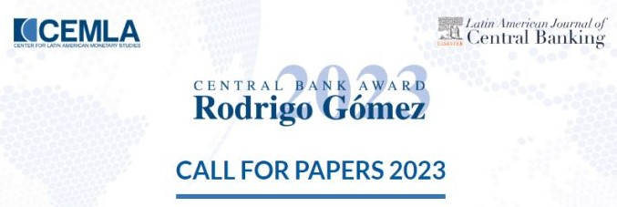
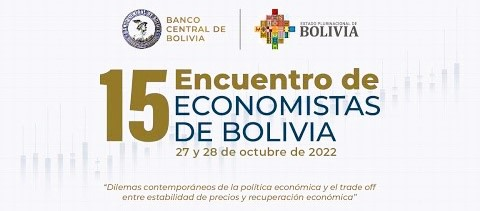
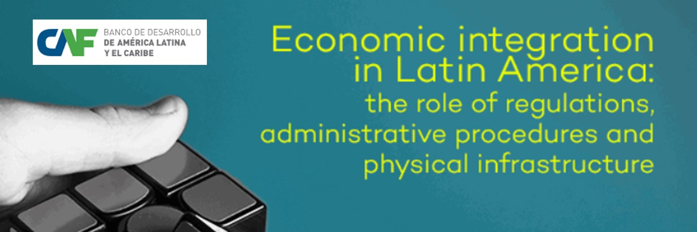
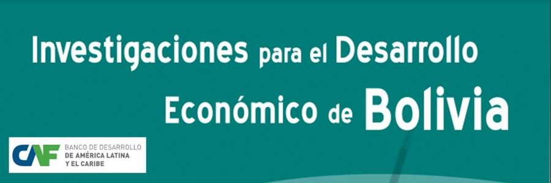
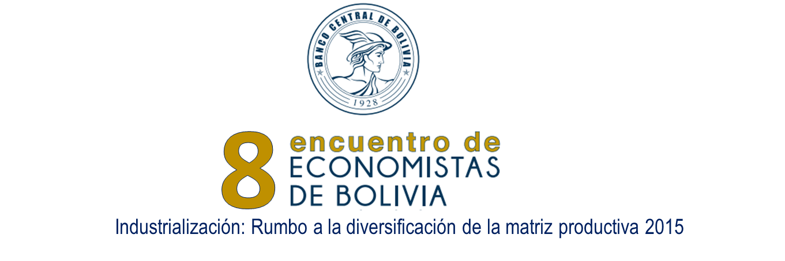
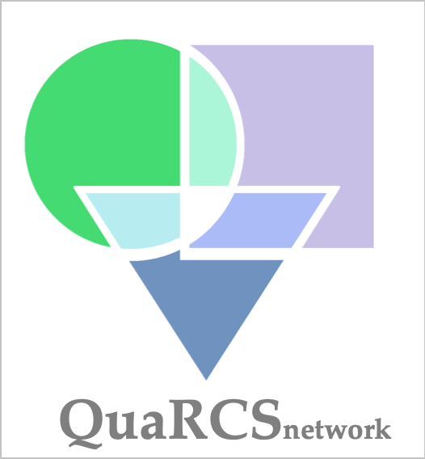
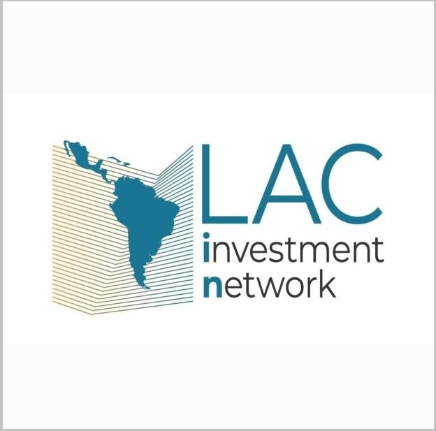

<!-- Google tag (gtag.js) -->

<!--html_preserve-->

<section class="about-hero home-hero">
  

    

      
    

    

      <h1>About</h1>
      
As an economist specializing in economic research, policy analysis, and data-driven decision-making, I am passionate about harnessing the transformative potential of AI and advanced econometric methods to address complex macro and microeconomic challenges. With a proven track record in leading AI-driven projects, conducting socio-economic assessments, and designing data governance frameworks, I am committed to evidence-based policy-making that promotes sustainable development. My expertise extends to collaborating with international organizations and providing technical insights to inform public policy in Bolivia, bridging technology and economic insights for a more informed and resilient future.

      

        <a class="btn btn-primary" href="docs/CV_Osmar_Bolivar_Sep2026.pdf" download="CV_Osmar_Bolivar_Sep2026.pdf">Download CV (PDF)</a>
        <a class="btn btn-secondary" href="Papers.html">See my papers</a>
      

    

  

</section>

<section class="page-block">
  

    <h2>Experience / Skills</h2>
    <ul class="skill-chips">
      <li>Economic Research</li>
      <li>AI</li>
      <li>Machine Learning</li>
      <li>Econometrics</li>
      <li>Remote Sensing</li>
      <li>Data Science</li>
      <li>Critical Thinking</li>
      <li>Problem Solving</li>
    </ul>
  

</section>

<section class="page-block subtle">
  

    <h2>Honors &amp; Awards</h2>
    

      <article class="award">
        

        
First Place
2023 Central Bank Award Rodrigo Gómez by the Center for Latin American Monetary Studies (CEMLA).

      </article>
      <article class="award">
        

        
First Place
2022 Meeting of Economists of Bolivia by the Central Bank of Bolivia.

      </article>
      <article class="award">
        

        
Finalist &amp; Funding
Research Proposal Call by the Development Bank of Latin America (CAF), 2021.

      </article>
      <article class="award">
        

        
Winner &amp; Funding
Research Proposal Call "Economic Development in Bolivia" by CAF, 2020.

      </article>
      <article class="award">
        

        
First Place
2015 Meeting of Economists of Bolivia by the Central Bank of Bolivia.

      </article>
    

  

</section>

<section class="page-block">
  

    <h2>Badges</h2>
    

    
  

</section>

<section class="page-block">
  

    <h2>Affiliations / Networks</h2>
    

      

      
      
    

  

</section>
<!--/html_preserve-->
