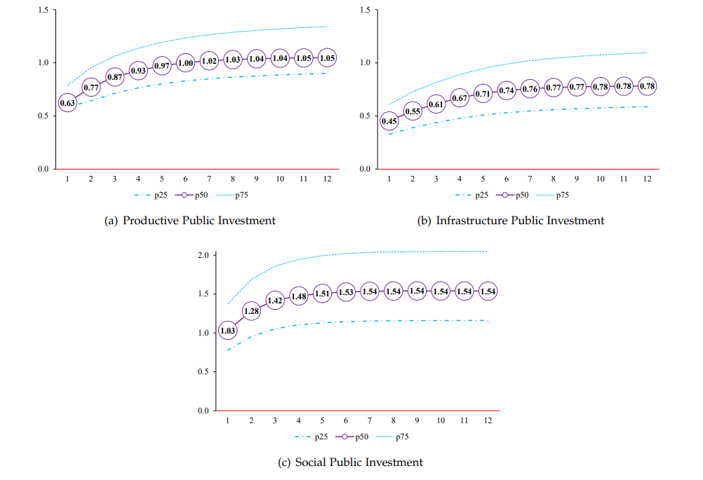

<!-- Google tag (gtag.js) -->

```{=html}
<script async src="https://www.googletagmanager.com/gtag/js?id=G-F5HJ5VRY62"></script>
```
```{=html}
<script>
  window.dataLayer = window.dataLayer || [];
  function gtag(){dataLayer.push(arguments);}
  gtag('js', new Date());

  gtag('config', 'G-F5HJ5VRY62');
</script>
```

```{r setup, include=FALSE}
knitr::opts_chunk$set(echo = TRUE)
```

```{=html}
<div class="article-kicker"><a href="portfolio.html">Portfolio</a><span aria-hidden="true">/</span><span>Research</span></div>
```

# Fiscal Multipliers

```{=html}
<p class="dek">Empirical evidence for a cost-effective allocation of public investment.</p>
```

<div style="text-align:center;">
  {width="70%" height="80%"}
</div>
<div style="margin-bottom: 30px;"></div>

Public investment is a crucial policy tool for fostering economic development, especially in countries like Bolivia, where government spending can significantly enhance economic activity and improve living standards. In this blog, I summarize my research <a href="https://ideas.repec.org/a/efp/journl/v5y2022i2p1-28.html" target="_blank"><strong>Fiscal Multipliers: Empirical Evidence for a Cost-Effective Allocation of Public</strong></a>, with a focus on fiscal multipliers of public investment at the sectoral level in Bolivia. By identifying sector-specific public investment shocks, I provide insights into the most cost-effective areas for public investment, comparing sectors such as infrastructure, productive, and social.


## Empirical Strategy

The empirical approach estimates the multiplier effects of public investment across various sectors as reported by the Bolivia's Vice Ministry of Public Investment and External Financing. The sectors are grouped into three major categories: Productive, Infrastructure, and Social. Each category consists of specific sub-sectors, as shown in ***Table 1***.


```{=html}
<figure class="data-table text">
<figcaption>Table 1. Major and Specific Sectors for Public Investment Allocation in Bolivia</figcaption>
<div class="table-wrap"><table>
<thead><tr><th>Major Sectors</th><th>Specific Sectors</th></tr></thead>
<tbody>
<tr><th class="l" scope="row">Productive</th><td class="l">Hydrocarbons; Agriculture; Industry; Mining; and Energy</td></tr>
<tr><th class="l" scope="row">Infrastructure</th><td class="l">Transportation; Communication; and Water Resources</td></tr>
<tr><th class="l" scope="row">Social</th><td class="l">Urban Planning; Education; Basic Sanitation; and Health</td></tr>
</tbody></table></div>
</figure>
```
<div style="margin-bottom: 30px;"></div>

### Estimation Framework

The multiplier effects are calculated as the cumulative response of nominal GDP to public investment shocks, based on the approach by **Ilzetzki et al. (2013)**[^1]. The cumulative multiplier ($M_T$) is defined as:

$$
M_T = \frac{\sum_{t=1}^T \Delta PIB_t}{\sum_{t=1}^T \Delta g_t}
$$

where $\Delta PIB_t$ and $\Delta g_t$ represent changes in nominal GDP and public investment, respectively.

To estimate these multiplier effects, Bayesian Structural Vector Autoregressive (BSVAR) models are employed. The key methodological challenge is identifying fiscal policy shocks, which is addressed using the identification algorithm by **Arias et al. (2018)**[^2]. This method uses sign and zero restrictions to identify structural shocks, allowing for a robust estimation of the effects of public investment.

Separate BSVAR models are constructed for each sector $i$ where public investment is allocated. The analysis uses quarterly data from 2006Q1 to 2022Q3, with the vector of endogenous variables including year-over-year variations in nominal GDP, nominal public investment in sector $i$, the Consumer Price Index (CPI), financial system liquidity, and the WTI oil price. The models include four lags to account for seasonal effects.

The identification strategy is designed to capture the dynamics of key structural shocks affecting the Bolivian economy, summarized in ***Table 2***.

```{=html}
<figure class="data-table">
<figcaption>Table 2. Identification Strategy for Structural Shocks</figcaption>
<div class="table-wrap"><table>
<thead><tr><th><span class="corner">Variables \ Shocks</span></th><th>Demand<sup>†</sup></th><th>Supply</th><th>Fiscal Policy</th><th>Monetary Policy</th><th>Commodities</th></tr></thead>
<tbody>
<tr><th class="l" scope="row">GDP</th><td>+ (<i>t</i> = 1)</td><td>+ (<i>t</i> = 1)</td><td>+ (<i>t</i> = 1)</td><td><span title="No restriction">•</span></td><td>+ (<i>t</i> = 1)</td></tr>
<tr><th class="l" scope="row">CPI</th><td>+ (<i>t</i> = 1)</td><td>− (<i>t</i> = 1)</td><td><span title="No restriction">•</span></td><td><span title="No restriction">•</span></td><td><span title="No restriction">•</span></td></tr>
<tr><th class="l" scope="row">Public Inv. in sector <i>i</i></th><td>0 (<i>t</i> = 1)</td><td><span title="No restriction">•</span></td><td>+ (<i>t</i> = 1, …, 4)</td><td><span title="No restriction">•</span></td><td><span title="No restriction">•</span></td></tr>
<tr><th class="l" scope="row">Financial System Liquidity</th><td><span title="No restriction">•</span></td><td><span title="No restriction">•</span></td><td><span title="No restriction">•</span></td><td>+ (<i>t</i> = 1)</td><td><span title="No restriction">•</span></td></tr>
<tr><th class="l" scope="row">WTI Price</th><td>0 (<i>t</i> = 1)</td><td>0 (<i>t</i> = 1)</td><td>0 (<i>t</i> = 1)</td><td>0 (<i>t</i> = 1)</td><td>+ (<i>t</i> = 1)</td></tr>
</tbody></table></div>
<p class="table-note">†: These demand shocks exclude the fiscal policy shock that increases public investment in sector <i>i</i> and the monetary policy shock.<br>Note: [+(<i>t</i> = 1)] indicates a positive contemporaneous effect on the variable of interest. [−(<i>t</i> = 1)] indicates a negative contemporaneous effect. [0(<i>t</i> = 1)] means the contemporaneous effect is null. [+(<i>t</i> = 1, …, 4)] indicates that the expansive effect is contemporaneous and persists for the following three quarters. [•] means no prior restriction is imposed, so the effect is determined by the model.</p>
</figure>
```
<div style="margin-bottom: 30px;"></div>

The identification assumptions are as follows:

- **Aggregate Supply and Demand Shocks**: Both have a positive contemporaneous effect on output, but differ in their impact on prices. Aggregate supply shocks typically lead to price reductions through productivity gains.

- **Expansionary Fiscal Policy Shock**: Defined as a discretionary increase in public investment sustained for at least one year, associated with a positive impact on output. Public investment in sector $i$ is budgeted in advance, making it unlikely to be contemporaneously adjusted in response to other economic shocks.

- **Monetary Policy Shocks**: Identified through increases in financial system liquidity. No contemporaneous effect on output is assumed, consistent with the notion that monetary policy does not have an immediate impact on aggregate activity.

- **Commodity Prices**: Treated as exogenous to domestic conditions. Domestic shocks do not contemporaneously affect international commodity prices, reflecting Bolivia's status as a small open economy.

For interpretation, the accumulated public investment multiplier for sector $i$ at time $T$ ($\hat{M}_{i,T}$) is computed as the ratio between the median values of the posterior distributions for accumulated GDP responses ($\hat{R}_T^{GDP}$) and public investment responses ($\hat{R}_T^{g}$).

<div style="margin-bottom: 30px;"></div>

## Key Findings

### Multiplier Effects Across Major Sectors

The analysis reveals that among the three major public investment categories, social investment yields the highest multiplier effect, making it the most cost-effective. ***Figure 1*** presents an overview of multiplier effects for public investment across Productive, Infrastructure, and Social sectors.


#### Social Investment as a Priority

Investments in social sectors, including urban development, education, health, and basic sanitation, show the strongest multiplier effects, with basic sanitation projects being particularly impactful. These projects, which employ a high proportion of locally sourced inputs and labor, contribute significantly to economic growth. ***Figure 2*** illustrates the multiplier effects of investments in specific social sectors.

<div style="text-align:center;">
  {width="70%" height="80%"}
</div>
<div style="margin-bottom: 30px;"></div>

Basic sanitation projects have a contemporaneous multiplier effect of 0.76 and a medium-term effect of 1.17, underscoring their importance in stimulating the economy while addressing fundamental needs.

### Productive and Infrastructure Investments

Productive investments, such as in hydrocarbons and agriculture, also exhibit significant multiplier effects, albeit lower than those for social sectors. The multiplier for hydrocarbons, for instance, exceeds one in the medium term, suggesting substantial potential for economic returns.

<div style="text-align:center;">
  {width="70%" height="90%"}
</div>
<div style="margin-bottom: 30px;"></div>

Infrastructure investment, while crucial for long-term growth, shows the lowest multiplier effect among the three categories. Transportation infrastructure, in particular, has the least immediate impact on GDP, indicating that while these investments are essential for enhancing productivity and market connectivity, their short-term effects are less pronounced.

<div style="text-align:center;">
{width="70%" height="80%"}
</div>
<div style="margin-bottom: 30px;"></div>

## Comparative Analysis of Sectoral Multipliers

***Table 3*** summarizes the estimated multiplier effects across sectors, highlighting those with the highest return per unit of investment.

```{=html}
<figure class="data-table">
<figcaption>Table 3. Summary of Public Investment Multiplier Effects by Sector</figcaption>
<div class="table-wrap"><table>
<thead><tr><th rowspan="2" class="l">Sector</th><th colspan="3">Contemporary</th><th colspan="3">Medium-Term</th></tr><tr><th><i>p25</i></th><th><i>p50</i></th><th><i>p75</i></th><th><i>p25</i></th><th><i>p50</i></th><th><i>p75</i></th></tr></thead>
<tbody>
<tr class="group"><th colspan="7">Major sectors</th></tr>
<tr><th class="l" scope="row">Social</th><td>0.78</td><td>1.03</td><td>1.37</td><td>1.16</td><td>1.54</td><td>2.04</td></tr>
<tr><th class="l" scope="row">Productive</th><td>0.58</td><td>0.63</td><td>0.79</td><td>0.93</td><td>1.06</td><td>1.38</td></tr>
<tr><th class="l" scope="row">Infrastructure</th><td>0.33</td><td>0.45</td><td>0.61</td><td>0.61</td><td>0.78</td><td>1.13</td></tr>
<tr class="group"><th colspan="7">Specific sectors</th></tr>
<tr><th class="l" scope="row">Sanitation</th><td>0.50</td><td>0.76</td><td>0.96</td><td>0.86</td><td>1.17</td><td>1.66</td></tr>
<tr><th class="l" scope="row">Hydrocarbons</th><td>0.71</td><td>1.04</td><td>1.28</td><td>0.85</td><td>1.16</td><td>1.54</td></tr>
<tr><th class="l" scope="row">Urban Dev.</th><td>0.46</td><td>0.58</td><td>0.80</td><td>0.83</td><td>1.05</td><td>1.45</td></tr>
<tr><th class="l" scope="row">Health</th><td>0.53</td><td>0.78</td><td>0.98</td><td>0.72</td><td>1.04</td><td>1.33</td></tr>
<tr><th class="l" scope="row">Agriculture</th><td>0.38</td><td>0.48</td><td>0.66</td><td>0.79</td><td>0.98</td><td>1.37</td></tr>
<tr><th class="l" scope="row">Communication</th><td>0.37</td><td>0.47</td><td>0.60</td><td>0.68</td><td>0.84</td><td>1.11</td></tr>
<tr><th class="l" scope="row">Education</th><td>0.31</td><td>0.49</td><td>0.69</td><td>0.57</td><td>0.81</td><td>1.28</td></tr>
<tr><th class="l" scope="row">Water</th><td>0.31</td><td>0.41</td><td>0.56</td><td>0.59</td><td>0.73</td><td>1.06</td></tr>
<tr><th class="l" scope="row">Energy</th><td>0.20</td><td>0.25</td><td>0.34</td><td>0.43</td><td>0.51</td><td>0.74</td></tr>
<tr><th class="l" scope="row">Transportation</th><td>0.16</td><td>0.24</td><td>0.30</td><td>0.34</td><td>0.44</td><td>0.64</td></tr>
<tr><th class="l" scope="row">Industry</th><td>0.11</td><td>0.14</td><td>0.18</td><td>0.22</td><td>0.26</td><td>0.37</td></tr>
<tr><th class="l" scope="row">Mining</th><td>0.06</td><td>0.11</td><td>0.18</td><td>0.13</td><td>0.19</td><td>0.39</td></tr>
</tbody></table></div>
<p class="table-note">Note: Sectors are ordered from highest to lowest based on the estimated median value of the medium-term cumulative multiplier effect.</p>
</figure>
```
<div style="margin-bottom: 30px;"></div>

The analysis indicates that sanitation projects, hydrocarbons, and urban development deliver the highest returns, while sectors like mining and industry exhibit lower multipliers, possibly due to longer project implementation periods.

## Policy Implications

The findings from this study offer significant insights for public policy in Bolivia. Prioritizing social investments, particularly in basic sanitation, can maximize economic returns from public spending. 

Infrastructure investments, while not yielding high short-term multipliers, are essential for improving productivity, reducing costs, and enhancing market access. A strategic approach is necessary to leverage the broader, long-term benefits of infrastructure.

## Conclusion

This study presents an alternative methodological framework for estimating fiscal multipliers using a sector-specific BSVAR approach. The findings emphasize the value of targeted public investment planning, demonstrating that investments in social infrastructure, such as basic sanitation and health, yield the highest economic returns in Bolivia.

These insights are intended to support policymakers in making evidence-based decisions to achieve cost-effective public resource allocation that aligns with broader economic growth objectives.

[^1]: Ilzetzki, E., Mendoza, E. G., y Végh, C. A. (2013). **How big (small?) are f iscal multipliers?** *Journal of monetary economics, 60(2)*:239–254.
[^2]: Arias, J. E., Rubio-Ramírez, J. F., y Waggoner, D. F. (2018). **Inference based on structural vector autoregressions identified with sign and zero restrictions: Theory and applications**. *Econometrica, 86(2)*:685–720.

