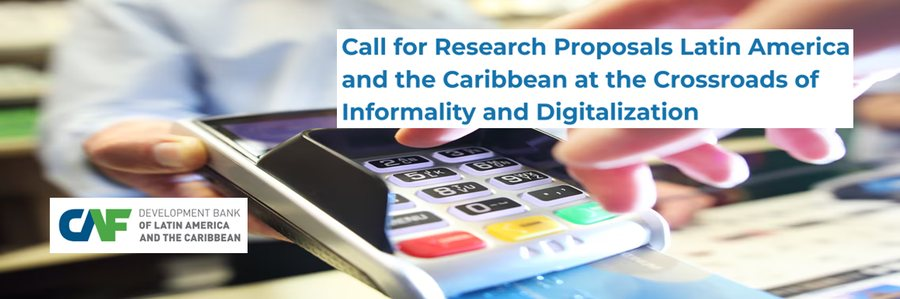

<!-- Spanish version of ../About.Rmd. When you change that page, update this one too. -->

<!-- Google tag (gtag.js) -->

<!--html_preserve-->

<section class="about-hero home-hero">
  

    

      
    

    

      <h1>Sobre mí</h1>
      
Como economista especializado en investigación económica, análisis de políticas y toma de decisiones basada en datos, me apasiona aprovechar el potencial transformador de la inteligencia artificial y de los métodos econométricos avanzados para abordar desafíos macroeconómicos y microeconómicos complejos. Con una trayectoria comprobada en la conducción de proyectos basados en inteligencia artificial, la realización de evaluaciones socioeconómicas y el diseño de marcos de gobernanza de datos, estoy comprometido con la formulación de políticas basadas en evidencia que promuevan el desarrollo sostenible. Mi experiencia incluye la colaboración con organismos internacionales y la provisión de insumos técnicos para orientar la política pública en Bolivia, uniendo la tecnología y el análisis económico en favor de un futuro mejor informado y más resiliente.

      

        <a class="btn btn-primary" href="../docs/CV_Osmar_Bolivar_Sep2026.pdf" download="CV_Osmar_Bolivar_Sep2026.pdf" hreflang="en">Descargar CV (PDF, en inglés)</a>
        <a class="btn btn-secondary" href="Papers.html">Ver mis publicaciones</a>
      

    

  

</section>

<section class="page-block">
  

    <h2>Experiencia / Habilidades</h2>
    <ul class="skill-chips">
      <li>Investigación económica</li>
      <li>Inteligencia artificial</li>
      <li>Machine learning</li>
      <li>Econometría</li>
      <li>Teledetección</li>
      <li>Ciencia de datos</li>
      <li>Pensamiento crítico</li>
      <li>Resolución de problemas</li>
    </ul>
  

</section>

<section class="page-block subtle">
  

    <h2>Premios y reconocimientos</h2>
    

      <article class="award">
        

        
Ganador y financiamiento
Convocatoria de propuestas de investigación del Banco de Desarrollo de América Latina y el Caribe (CAF), 2025.

      </article>
      <article class="award">
        

        
Primer lugar
Premio de Banca Central Rodrigo Gómez 2023, otorgado por el Centro de Estudios Monetarios Latinoamericanos (CEMLA).

      </article>
      <article class="award">
        

        
Primer lugar
Encuentro de Economistas de Bolivia 2022, organizado por el Banco Central de Bolivia.

      </article>
      <article class="award">
        

        
Finalista y financiamiento
Convocatoria de propuestas de investigación del Banco de Desarrollo de América Latina (CAF), 2021.

      </article>
      <article class="award">
        

        
Ganador y financiamiento
Convocatoria de propuestas de investigación «Desarrollo Económico en Bolivia» de CAF, 2020.

      </article>
      <article class="award">
        

        
Primer lugar
Encuentro de Economistas de Bolivia 2015, organizado por el Banco Central de Bolivia.

      </article>
    

  

</section>

<section class="page-block">
  

    <h2>Insignias</h2>
    

    
  

</section>

<section class="page-block">
  

    <h2>Afiliaciones / Redes</h2>
    

      

      
      
      
    

  

</section>
<!--/html_preserve-->
