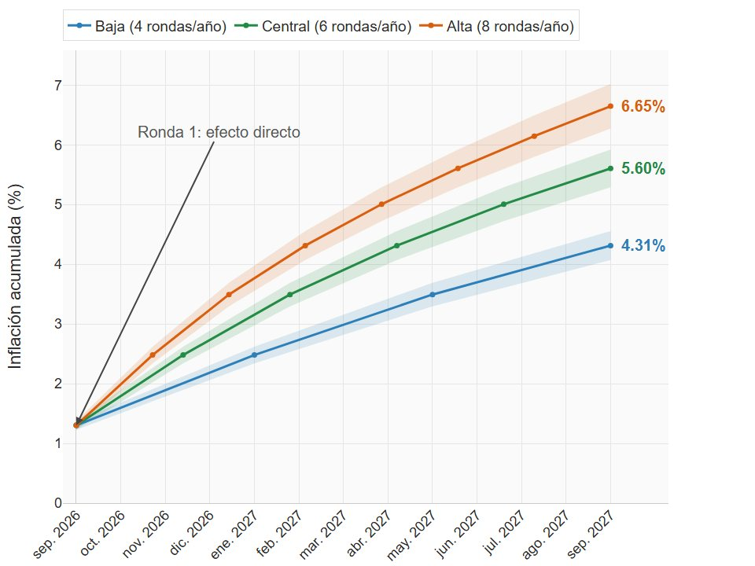
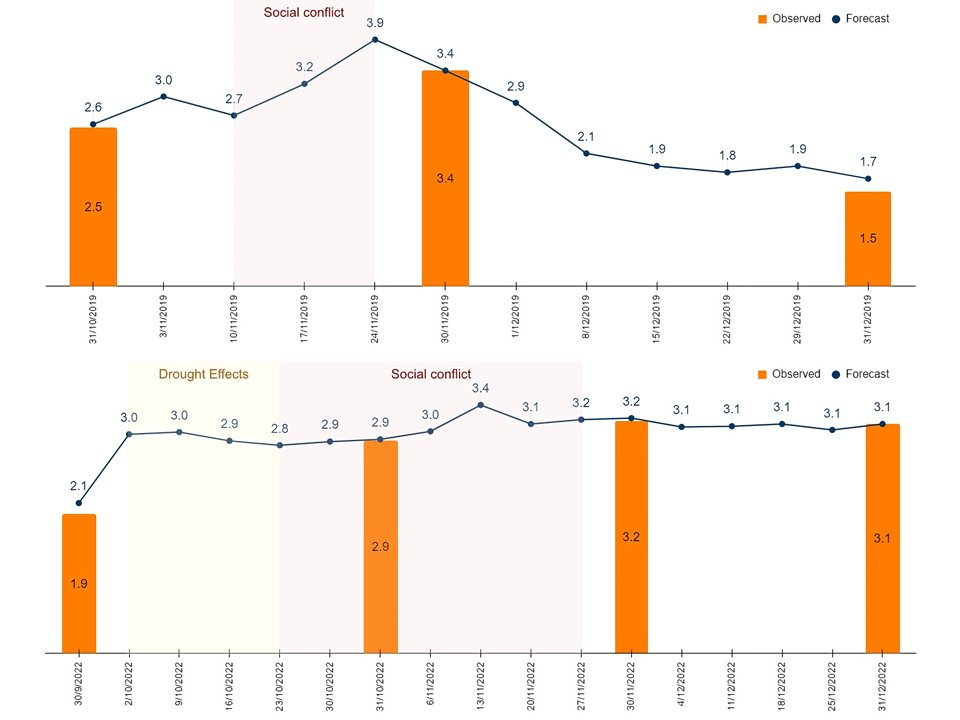
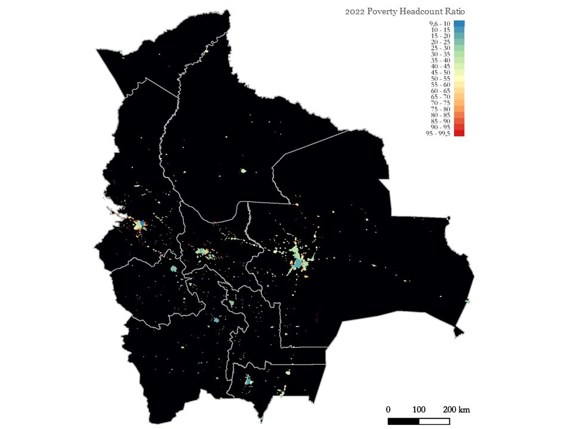

<!-- Spanish version of ../index.Rmd. Knit this file directly in RStudio. -->

<!-- Google tag (gtag.js) -->

<!--html_preserve-->

  <section class="home-hero">
    

      

        Economista · Econometría · IA y ciencia de datos
        <h1>Osmar Bolivar Rosales</h1>
        
Como economista especializado en investigación económica, análisis de políticas y toma de decisiones basada en datos, me apasiona aprovechar el potencial transformador de la inteligencia artificial y de los métodos econométricos avanzados para abordar desafíos macroeconómicos y microeconómicos complejos.

        

          <a class="btn btn-primary" href="About.html">Sobre mí</a>
          <a class="btn btn-secondary" href="portfolio.html">Ver portafolio</a>
        

      

      

        
      

    

  </section>

  <section class="page-block">
    

      

        <h2>Trabajos recientes</h2>
        <a class="more" href="portfolio.html">Ver todo el trabajo →</a>
      

      
Acceda a un repositorio de evidencia empírica y análisis orientados a impulsar la investigación económica y a respaldar la toma de decisiones basada en evidencia. Esta plataforma ofrece tanto recursos académicos como aplicaciones prácticas de herramientas econométricas y de inteligencia artificial para el análisis socioeconómico.

      

        <a class="card" href="../Portfolio/subvencion_diesel_inflacion/diesel_subsidy_pass_through.html">
          

          

            
Investigación

            <h3 class="card-title">Fin de la subvención al diésel e inflación</h3>
            
Cómo se traslada a los precios, sector por sector, la liberalización del precio del diésel de 2026 en Bolivia.

          

        </a>
        <a class="card" href="../R_Week_Inflation.html" hreflang="en">
          

          

            
InvestigaciónEN

            <h3 class="card-title">Pronóstico semanal de la inflación con machine learning</h3>
            
Una metodología novedosa de machine learning en dos etapas para pronosticar la inflación semanal.

          

        </a>
        <a class="card" href="../R_poverty.html" hreflang="en">
          

          

            
InvestigaciónEN

            <h3 class="card-title">Mapa de pobreza a nivel comunitario</h3>
            
Cómo evolucionó la pobreza a nivel comunitario en Bolivia entre 2012 y 2022.

          

        </a>
      

    

  </section>

  <section class="page-block subtle">
    

      

        <h2>Publicaciones recientes</h2>
        <a class="more" href="Papers.html">Todas las publicaciones →</a>
      

      
Conozca en profundidad mi investigación, publicada en revistas académicas y documentos de trabajo.

      <ul class="pub-list">
        <li>2026<a class="pub-title" href="../docs/papers_docs/PAPER_Hit_the_road_Juan.pdf" lang="en">Hit the Road Juan: Welfare and Labor Market Effects of High-Quality Roads in Ecuador</a>Documento presentado en la 18.ª Reunión de la Red de Evaluación de Impacto de LACEA (con G. Canavire-Bacarreza y A. Balthrop)</li>
        <li>2026<a class="pub-title" href="https://www.sciencedirect.com/science/article/pii/S2666143825000109" lang="en">High-frequency Inflation Forecasting: A Two-step Machine Learning Methodology</a>Latin American Journal of Central Banking</li>
        <li>2025<a class="pub-title" href="https://papers.ssrn.com/sol3/papers.cfm?abstract_id=5353057" lang="en">Sentiment, Cryptocurrency and Inflation: A Transmission Channel in Bolivia</a>Disponible en SSRN (con C. Huanto)</li>
        <li>2024<a class="pub-title" href="https://www.sciencedirect.com/science/article/pii/S2666143824000085" lang="en">GDP Nowcasting: A Machine Learning and Remote Sensing Data-based Approach for Bolivia</a>Latin American Journal of Central Banking</li>
      </ul>
    

  </section>

  <section class="page-block">
    

      

        <h2>Contacto</h2>
        
Si necesita información adicional, no dude en escribirme.

      

      

        <a class="email" href="mailto:osmar.economics@gmail.com">osmar.economics@gmail.com</a>
        <a href="https://www.linkedin.com/in/osmar-bolivar-rosales/">LinkedIn</a>
        <a href="https://www.researchgate.net/profile/Osmar-Bolivar">ResearchGate</a>
        <a href="https://orcid.org/0009-0002-2297-2217">ORCID</a>
        <a href="https://github.com/osmarbolivar">GitHub</a>
        <a href="https://x.com/OsmarBolivarR" rel="me">Sígueme en X</a>
      

    

  </section>

<!--/html_preserve-->
