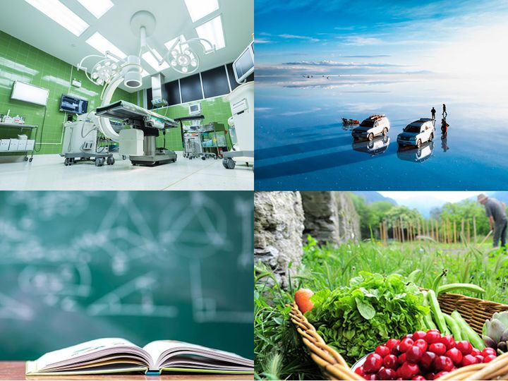
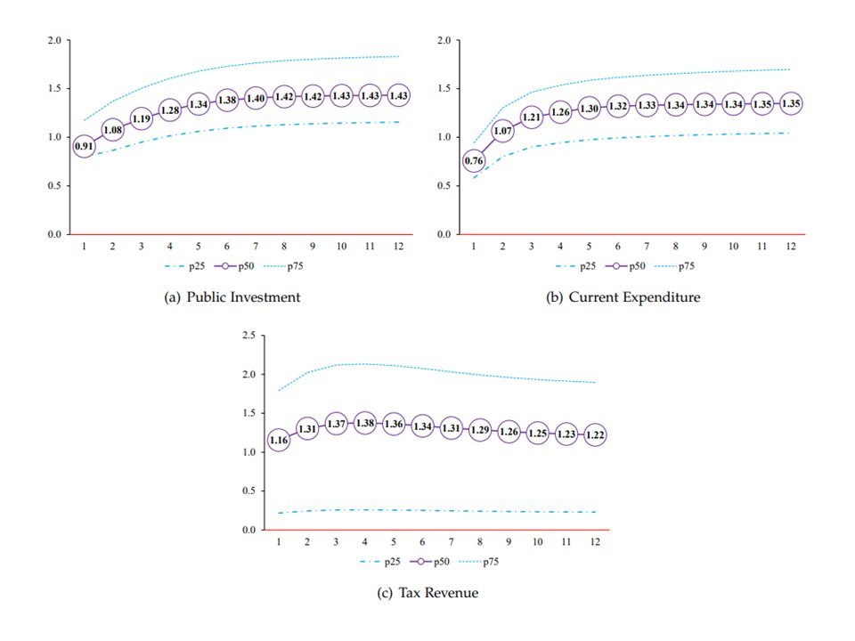
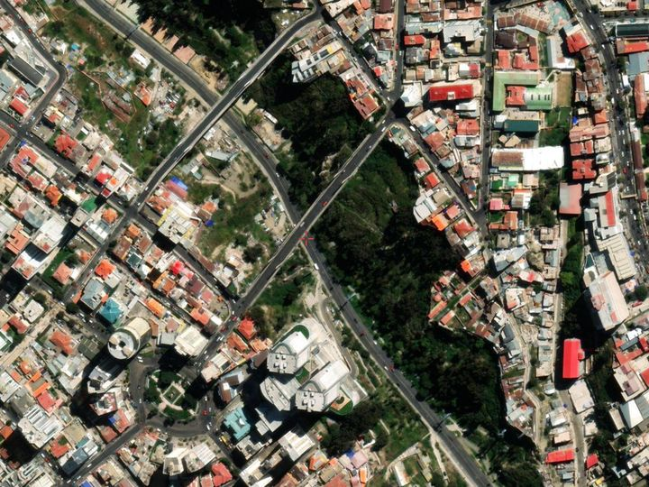
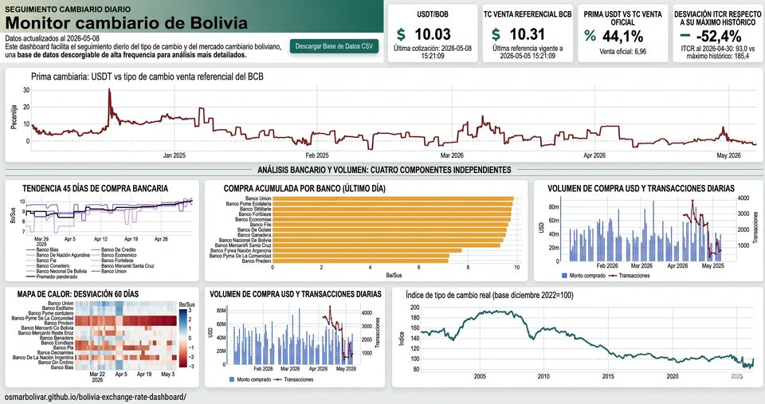

<!-- Spanish version of ../portfolio.Rmd. When you add an item there, add it here too. -->

<!-- Google tag (gtag.js) -->

```{=html}
<script async src="https://www.googletagmanager.com/gtag/js?id=G-F5HJ5VRY62"></script>
```
```{=html}
<script>
  window.dataLayer = window.dataLayer || [];
  function gtag(){dataLayer.push(arguments);}
  gtag('js', new Date());

  gtag('config', 'G-F5HJ5VRY62');
</script>
```

<!--html_preserve-->
<script>
  // Listing layout manages its own width and spacing.
  document.getElementById("pageContent").classList.remove("standardPadding");
</script>

<div class="page-title">
  <div class="wrap-wide">
    <h1>Portafolio</h1>
    <p class="dek">Repositorio de evidencia empírica y análisis técnicos.</p>
  </div>
</div>

<section class="page-block">
  <div class="wrap-wide">
    <div class="block-head"><h2>Investigación</h2></div>
    <p class="block-intro">Emprenda un recorrido académico por estudios empíricos, análisis econométricos y hallazgos relevantes en la sección de Investigación. Descubra las complejidades de los fenómenos socioeconómicos y contribuya al diálogo académico. Los trabajos marcados con <span class="tag soon">EN</span> están disponibles solo en inglés.</p>
    <div class="card-grid">
      <a class="card" href="../Portfolio/subvencion_diesel_inflacion/diesel_subsidy_pass_through.html">
        <div class="card-img"></div>
        <div class="card-body">
          <h3 class="card-title">Fin de la subvención al diésel e inflación</h3>
          <p class="card-desc">Cómo se traslada a los precios, sector por sector, la liberalización del precio del diésel de 2026 en Bolivia.</p>
        </div>
      </a>
      <a class="card" href="../R_Week_Inflation.html" hreflang="en">
        <div class="card-img"></div>
        <div class="card-body">
          <div class="card-tags"><span class="tag soon" title="En inglés">EN</span></div>
          <h3 class="card-title">Pronóstico semanal de la inflación con machine learning</h3>
          <p class="card-desc">Una metodología novedosa de machine learning en dos etapas para pronosticar la inflación semanal.</p>
        </div>
      </a>
      <a class="card" href="../R_poverty.html" hreflang="en">
        <div class="card-img"></div>
        <div class="card-body">
          <div class="card-tags"><span class="tag soon" title="En inglés">EN</span></div>
          <h3 class="card-title">Mapa de pobreza a nivel comunitario</h3>
          <p class="card-desc">Cómo evolucionó la pobreza a nivel comunitario en Bolivia entre 2012 y 2022.</p>
        </div>
      </a>
      <a class="card" href="../R_multipliers.html" hreflang="en">
        <div class="card-img"></div>
        <div class="card-body">
          <div class="card-tags"><span class="tag soon" title="En inglés">EN</span></div>
          <h3 class="card-title">Actividades que impulsan el crecimiento y el empleo</h3>
          <p class="card-desc">Cómo priorizar actividades económicas para fomentar el crecimiento y la creación de empleo.</p>
        </div>
      </a>
      <a class="card" href="../R_Fiscal_Multiplier.html" hreflang="en">
        <div class="card-img"></div>
        <div class="card-body">
          <div class="card-tags"><span class="tag soon" title="En inglés">EN</span></div>
          <h3 class="card-title">Multiplicadores fiscales</h3>
          <p class="card-desc">Evidencia empírica para una asignación costo-efectiva de la inversión pública.</p>
        </div>
      </a>
      <a class="card" href="../R_built_up.html" hreflang="en">
        <div class="card-img"></div>
        <div class="card-body">
          <div class="card-tags"><span class="tag soon" title="En inglés">EN</span></div>
          <h3 class="card-title">Áreas urbanizadas de Bolivia</h3>
          <p class="card-desc">Descargue un archivo ráster con la clasificación de áreas urbanizadas de Bolivia en 2022.</p>
        </div>
      </a>
      <a class="card" href="../R_Education.html" hreflang="en">
        <div class="card-img"></div>
        <div class="card-body">
          <div class="card-tags"><span class="tag soon" title="En inglés">EN</span></div>
          <h3 class="card-title">Educación en Bolivia</h3>
          <p class="card-desc">Acceso a la educación, disparidades y esfuerzos para optimizar la asignación de recursos.</p>
        </div>
      </a>
    </div>
  </div>
</section>

<section class="page-block">
  <div class="wrap-wide">
    <div class="block-head"><h2>Tableros</h2></div>
    <p class="block-intro">La sección de Tableros transforma datos económicos complejos en visualizaciones claras, que ofrecen perspectivas sobre diversas dimensiones de la economía.</p>
    <div class="card-grid">
      <a class="card" href="https://osmarbolivar.github.io/bolivia-exchange-rate-dashboard/">
        <div class="card-img"></div>
        <div class="card-body">
          <h3 class="card-title">Monitor Cambiario de Bolivia</h3>
          <p class="card-desc">Tipo de cambio oficial y paralelo, y dinámica del mercado cambiario.</p>
        </div>
      </a>
    </div>
  </div>
</section>

<section class="page-block">
  <div class="wrap-wide">
    <div class="block-head"><h2>Artículos</h2></div>
    <p class="block-intro">Explore reflexiones en la sección de Artículos: desde análisis profundos de temas estructurales hasta lecturas oportunas de la coyuntura económica, cada artículo contribuye a un debate informado en el ámbito de la economía.</p>
    <ul class="pub-list press">
        <li><time class="pub-year" datetime="2026-09-30">30 sep 2026</time><a class="pub-title" href="https://eldeber.com.bo/opinion/diesel-efecto-domino-precios_1790734236" target="_blank" rel="noopener">Diésel: el efecto dominó en los precios</a><span class="pub-venue">El Deber</span><span class="press-desc">Cómo el aumento del 83% en el precio del diésel se propaga por los precios, mucho más allá de los sectores que más combustible usan.</span></li>
        <li><time class="pub-year" datetime="2026-09-18">18 sep 2026</time><a class="pub-title" href="https://eldeber.com.bo/opinion/credibilidad-exito-politica-economica_1789680686" target="_blank" rel="noopener">Credibilidad y éxito de la política económica</a><span class="pub-venue">El Deber</span><span class="press-desc">Por qué una misma medida técnica puede funcionar o fracasar según la credibilidad del gobierno que la aplica.</span></li>
        <li><time class="pub-year" datetime="2026-09-03">3 sep 2026</time><a class="pub-title" href="https://www.urgente.bo/noticia/no-diesel-subsidiado-si-apoyo-focalizado" target="_blank" rel="noopener">No diésel subsidiado, Sí apoyo focalizado</a><span class="pub-venue">Urgente.bo</span><span class="press-desc">Argumentos para reemplazar el subsidio generalizado a los combustibles por un apoyo focalizado en los hogares vulnerables.</span></li>
        <li><time class="pub-year" datetime="2026-07-02">2 jul 2026</time><a class="pub-title" href="https://eldeber.com.bo/opinion/camino-ordenado-dolar_1782945646" target="_blank" rel="noopener">El camino ordenado del dólar</a><span class="pub-venue">El Deber</span><span class="press-desc">La transición de Bolivia del tipo de cambio fijo de Bs 6,96 a una flotación administrada, y cómo hacerla de forma ordenada.</span></li>
    </ul>
    <p class="press-more"><a href="https://eldeber.com.bo/tag/osmar-bolivar-rosales" target="_blank" rel="noopener">Todas mis columnas en El Deber →</a></p>
  </div>
</section>
<!--/html_preserve-->
