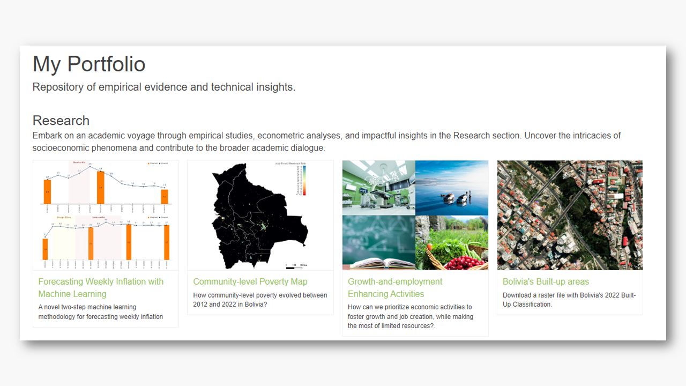

```{js, echo=FALSE}
$("#rStudioHeader").removeClass("alwaysShrunk");
$("#pageContent").removeClass("standardPadding");
```

<!-- Google tag (gtag.js) -->
<script async src="https://www.googletagmanager.com/gtag/js?id=G-F5HJ5VRY62"></script>
<script>
  window.dataLayer = window.dataLayer || [];
  function gtag(){dataLayer.push(arguments);}
  gtag('js', new Date());

  gtag('config', 'G-F5HJ5VRY62');
</script>


<!--html_preserve-->


<div id="homeContent">
  <div class="band full orange first rightText">
    <div class="bandContent vCenter">
      <div class="blurb">
        <div class="tagline">A Little About Myself.</div>
        <div>Passionate about driving transformative progress at the intersection of AI and data-driven economics. Committed to shaping a future where data serves as a dynamic catalyst for informed governance and sustainable development. Ready to contribute to innovative solutions that bridge technology and economic insights.
        </div>
      </div>
      <div class="actions">
        <div><a href="About.html"><button class="bigButton getStarted">Learn more</button></a></div>
        </div>
    </div>
    
  </div>

  <div class="band full gray1 second leftText">
    <div class="bandContent vCenter">
      <div class="blurb">
        <div>
        Discover a repository of empirical evidence and technical insights designed to foster in-depth exploration and dialogue on tools aimed at enhancing evidence-based decision-making and economic research. This platform is dedicated to providing content that serves not only academic interests but also offers practical examples showcasing the utilization of AI for socioeconomic analysis.
        </div>
        <div class="actions">
        <div><a href="portfolio.html"><button class="bigButton gallery">My Portfolio</button></a></div>
        </div>
      </div>
    </div>
    
  </div>

  <div class="band full third rightText">
    
    <div class="bandContent vCenter">
      <div class="blurb">
        <div>
        Uncover the depth of my research in academic journals and working papers.
        </div>
        <div class="actions">
          <div><a href="Papers.html"><button class="bigButton getStarted">Journal/Working Papers</button></a></div>
        </div>
      </div>
    </div>
  </div>
  
  <div class="band full gray2 fourth leftText">
    <div class="bandContent vCenter">
      <div class="blurb">
        <div class="tagline">Get in touch.</div>
        <div>Should you require additional information, please do not hesitate to reach out to me.</div> 
        <div><font color="#8fb538">osmar.economics@gmail.com</font></a></div>
        <div><a href="https://www.linkedin.com/in/osmar-bolivar-rosales/"></a> <a href="https://github.com/osmarbolivar/"></a> <a href="https://orcid.org/0009-0002-2297-2217"></a></div>
      </div>
    </div>
    
  </div>
</div>

<!--/html_preserve-->
