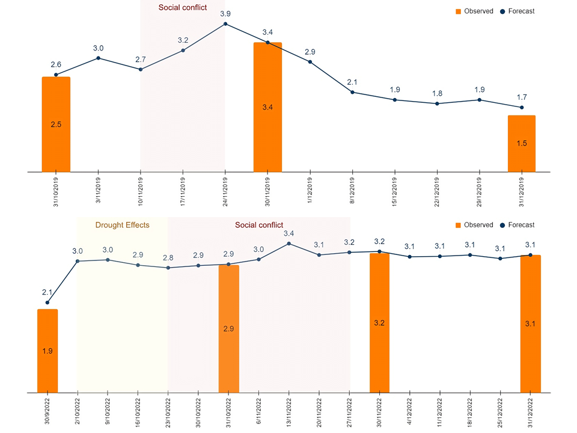
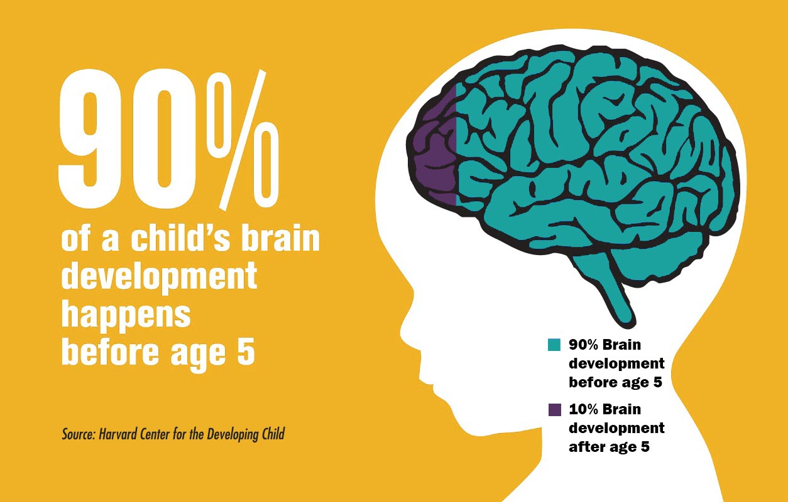

<!-- Google tag (gtag.js) -->

```{=html}
<script async src="https://www.googletagmanager.com/gtag/js?id=G-F5HJ5VRY62"></script>
```
```{=html}
<script>
  window.dataLayer = window.dataLayer || [];
  function gtag(){dataLayer.push(arguments);}
  gtag('js', new Date());

  gtag('config', 'G-F5HJ5VRY62');
</script>
```

<!--html_preserve-->

<div class="band full">
  <div class="bandContent pageTitle">My Portfolio</div>
  <div class="bandContent pageIntro">Repository of empirical evidence and technical insights.</div>
  <div class="bandContent gallerySection">
    <div class="gallerySectionTitle">Research</div>
    <div class="galleryIntro">Embark on an academic voyage through empirical studies, econometric analyses, and impactful insights in the Research section. Uncover the intricacies of socioeconomic phenomena and contribute to the broader academic dialogue.</div>
    <div class="galleryItems">
      <div class="galleryItem">
        <a href="R_Week_Inflation.html"></a>
        <a href="R_Week_Inflation.html" class="galleryItemLabel">Forecasting Weekly Inflation with Machine Learning</a>
        <div class="galleryItemDescription">A novel two-step machine learning methodology for forecasting weekly inflation</div>
      </div>
      <div class="galleryItem">
        <a href="R_poverty.html"></a>
        <a href="R_poverty.html" class="galleryItemLabel">Community-level Poverty Map</a>
        <div class="galleryItemDescription">How community-level poverty evolved between 2012 and 2022 in Bolivia?</div>
      </div>
      <div class="galleryItem">
        <a href="R_multipliers.html"></a>
        <a href="R_multipliers.html" class="galleryItemLabel">Growth-and-employment Enhancing Activities</a>
        <div class="galleryItemDescription">How can we prioritize economic activities to foster growth and job creation, while making the most of limited resources?.</div>
      </div>
      <div class="galleryItem">
        <a href="R_built_up.html">
        <a href="R_built_up.html" class="galleryItemLabel">Bolivia's Built-up areas</a>
        <div class="galleryItemDescription">Download a raster file with Bolivia's 2022 Built-Up Classification.</div>
      </div>
      <div class="galleryItems">
      <div class="galleryItem">
        <a href="R_Fiscal_Multiplier.html"></a>
        <a href="R_Fiscal_Multiplier.html" class="galleryItemLabel">Fiscal Multipliers</a>
        <div class="galleryItemDescription">Empirical Evidence for a Cost-Effective Allocation of Public Investment</div>
      </div>
      <div class="galleryItem">
        <a href="R_Education.html"></a>
        <a href="R_Education.html" class="galleryItemLabel">Education in Bolivia</a>
        <div class="galleryItemDescription">The strides made in providing accessible education, disparities, and the ongoing efforts to optimize the allocation of resources.</div>
      </div>
    </div>
  </div>


  <div class="bandContent gallerySection">
    <div class="gallerySectionTitle">Dashboards</div>
    <div class="galleryIntro">Immerse yourself in dynamic data visualization. The Dashboards section transforms complex economic data into engaging visuals, offering insightful perspectives on various economic dimensions.</div>
    <div class="galleryItems">
      <div class="galleryItem">
        <a href="D_Macro.html"></a>
        <a href="D_Macro.html" class="galleryItemLabel">Bolivia: Macro indicators</a>
        <div class="galleryItemDescription">GDP, inflation, unemployment and others.</div>
      </div>
    </div>
  </div>

  <div class="bandContent gallerySection">
    <div class="gallerySectionTitle">Articles</div>
    <div class="galleryIntro">Explore thought-provoking narratives in the Articles section. From in-depth analyses of structural matters to timely reflections on economic events, each article contributes to informed discussions in the realm of economics.</div>
    <div class="galleryItems">
      <div class="galleryItem">
        <a href="A_early_child.html"></a>
        <a href="A_early_child.html" class="galleryItemLabel">Early childhood.</a>
        <div class="galleryItemDescription">How early childhood determines success?</div>
      </div>
    </div>
  </div>
</div>


<!--/html_preserve-->
